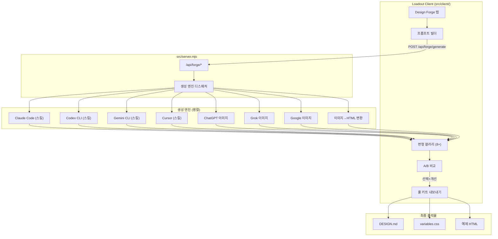

# Design Forge - Loadout 디자인 시스템 생성기 통합

## 핵심 아이디어

design-system 프로젝트의 **장점**(토너먼트 비교, Elo 랭킹, 스킬 레지스트리, 프롬프트 전략)을 가져오되, **단점**(복잡한 채점, Vite+React 별도앱)을 버리고, Loadout의 기존 React 클라이언트(`src/client/`)와 Node 서버(`src/server.mjs`)에 직접 통합합니다.

## 아키텍처

## 데이터 모델 (`data/forge/`)

- `data/forge/sessions/` - 각 생성 세션
  - `{sessionId}/meta.json` - 프롬프트, 설정, 상태
  - `{sessionId}/variants/` - 생성된 변형들 (HTML/이미지)
  - `{sessionId}/matches.json` - A/B 비교 결과 (Elo 점수)
  - `{sessionId}/output/` - 최종 풀 키트 결과물

## 서버 API 엔드포인트 (`src/server.mjs`)

- `POST /api/forge/session` - 새 세션 생성 (프롬프트, 엔진 설정)
- `GET /api/forge/sessions` - 세션 목록
- `POST /api/forge/generate` - 8개+ 변형 병렬 생성 시작
- `GET /api/forge/session/:id/status` - 생성 진행 상태 (SSE)
- `POST /api/forge/match` - A/B 비교 결과 기록 (Elo 업데이트)
- `POST /api/forge/refine` - 선택된 변형 기반 개선 생성
- `POST /api/forge/export` - 풀 키트 내보내기

## 생성 엔진 분배 (8개 변형 기준)

**HTML 스킬 생성 (4개):**
1. `claude -p` + frontend-design 스킬
2. `codex -p` + supanova-taste 스킬
3. `gemini -p` + reference-design 스킬
4. `claude -p` + supanova-soft 스킬

**이미지 생성 (4개):**
1. ChatGPT 이미지 (CDP via `skills/web-image-forge/lib/chrome.js`)
2. Grok 이미지 (CDP via `skills/web-image-forge/lib/grok.js`)
3. Google 이미지 생성 (새로 추가)
4. 이미지->HTML 변환 (위 3개 중 하나 선택 후 HTML 코딩)

## 프롬프트 전략 (design-system에서 차용)

- **minimal**: 한 줄 설명만. 모델의 기본 taste 테스트
- **detailed**: 섹션별 레이아웃 명세 포함
- **reference**: 참고 사이트 + 디자인 토큰 포함
- **system**: 전체 디자인 시스템 제약 적용

프롬프트에 따라 같은 엔진도 다른 결과를 내므로 전략 조합으로 변형 수를 늘릴 수 있습니다.

## 사람 개입 워크플로우

1. **프롬프트 입력** - 어떤 디자인을 원하는지 설명
2. **병렬 생성** - 8개+ 변형이 동시에 생성됨 (진행률 표시)
3. **갤러리 브라우징** - 썸네일/미리보기로 빠르게 훑기
4. **빠른 탈락** - 마음에 안 드는 것 즉시 제거 (Triage)
5. **A/B 비교** - 남은 것들 중 1:1 비교 (토너먼트 방식, Elo)
6. **개선** - 선택된 변형을 기반으로 미세 조정 요청
7. **풀 키트 내보내기** - DESIGN.md + CSS + HTML 출력

## 주요 파일 변경/생성

### 서버 (새 파일)
- `src/forge.mjs` - Forge 엔진 로직 (생성/비교/내보내기)
- `src/forge-engines.mjs` - 엔진별 어댑터 (CLI shell-out + CDP)

### 클라이언트 (새 파일)
- `src/client/src/components/Forge.tsx` - 메인 탭 컴포넌트
- `src/client/src/components/ForgeGallery.tsx` - 변형 갤러리
- `src/client/src/components/ForgePairwise.tsx` - A/B 비교 UI
- `src/client/src/components/ForgeExport.tsx` - 내보내기 UI
- `src/client/src/hooks/useForge.ts` - Forge 상태 관리

### 기존 파일 수정
- `src/server.mjs` - `/api/forge/*` 라우트 추가
- `src/client/src/App.tsx` - Forge 탭 추가
- `src/client/src/components/Header.tsx` - 네비게이션에 Forge 탭

## design-system에서 가져올 것 (장점)

- Elo 기반 pairwise 비교 (`src/lib/elo.ts` 로직)
- 토너먼트 상태 관리 패턴 (`tournament.ts`)
- 스킬 레지스트리 구조 (`skills/registry.json`)
- 프롬프트 전략 4단계 시스템
- 변형 메타데이터 스키마 (generatedAt, timeMs, fileSize)

## design-system에서 버릴 것 (단점)

- 복잡한 8카테고리 루브릭 채점 (사람이 직접 고르는 게 빠름)
- AI 자동 채점 (주관적이라 신뢰도 낮음)
- Mantine/BlockNote 등 무거운 의존성
- 별도 Vite 앱 구조 (Loadout에 통합)
- 점수 가중치 시스템 (체감과 안 맞음)

## 차별점: 이미지 파이프라인

기존 design-system에 없는 핵심 기능:

1. **이미지 생성 엔진** - ChatGPT/Grok/Google로 디자인 이미지 생성
2. **이미지 -> HTML 변환** - 마음에 드는 이미지를 선택하면 AI가 HTML로 구현
3. **혼합 비교** - HTML 직접 생성물과 이미지 기반 생성물을 나란히 비교

이미지 생성 시 프롬프트가 핵심이므로, 같은 의도를 다르게 표현한 프롬프트 변형도 자동 생성합니다.
