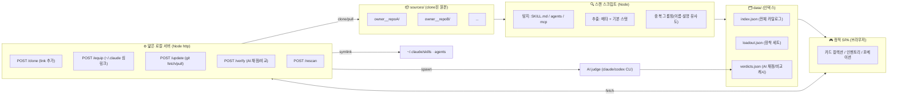

# 01 · 시스템 구조

## 설계 원칙

- **가볍게** — 빌드 단계 없는 바닐라 JS, DB 없음. 상태는 JSON 파일.
- **오프라인 우선** — 카탈로그 탐색/비교는 네트워크 없이 동작. 네트워크는 clone/update/AI 때만.
- **읽기와 쓰기 분리** — 스캔(읽기)으로 인덱스를 만들고, 서버(쓰기)는 clone/장착/업데이트 같은 "행동"만.
- **ref와 독립** — 원본은 `loadout/sources/`에 직접 clone해 Loadout이 소유. `D:/lab/ref`는 건드리지 않는다.

## 3-레이어 구조

### ① 스캔 스크립트 (읽기 전용)

`node src/scan.mjs` — `sources/`의 모든 repo를 훑어 `data/index.json` 생성.

- **탐지 규칙** → [02-data-model.md](02-data-model.md#탐지-규칙) 참조.
- **기본 스탯 산출** — GitHub stars, 최근 커밋, 도구 수, 설명 길이 등 객관 지표만 (AI 없음, 무료/즉시).
- **중복 그룹핑** — 이름/설명을 정규화해 유사 후보를 같은 그룹으로 묶음(임베딩 없이 토큰 유사도부터).
- 결과는 순수 JSON. 멱등(idempotent) — 언제 다시 돌려도 같은 입력→같은 출력.

### ② 데이터 (상태)

| 파일 | 내용 | 누가 씀 |
|------|------|--------|
| `data/index.json` | 전체 카탈로그(모든 skill/agent/mcp + 기본 스탯 + 중복 그룹) | 스캔 |
| `data/loadout.json` | 장착 세트(인벤토리) + 핀 고정 버전 | 서버(/equip) |
| `data/verdicts.json` | AI 채점 결과(`+99`)·비교 판정 캐시 | 서버(/verify) |
| `data/sources.json` | 등록된 소스 repo 목록 + 마지막 커밋 해시 | 서버(/clone, /update) |

> JSON만 쓰는 이유: diff/백업/이식이 쉽고, 바닐라 JS가 그대로 `fetch`로 읽는다. 규모가 정말 커지면 SQLite로 승격 가능(지금은 불필요).

### ③ 웹 SPA (탐색/비교) + 얇은 서버 (행동)

- **SPA** (`src/web/`) — `index.json`을 읽어 카드/인벤토리/포메이션 화면 렌더. 빌드 없음, 바닐라 JS + CSS.
- **로컬 서버** (`src/server.mjs`) — Node 내장 `http`만으로 5개 액션 엔드포인트. 프레임워크 없음.

| 엔드포인트 | 하는 일 |
|-----------|--------|
| `POST /clone {url}` | GitHub URL → `sources/<owner>__<repo>`에 clone → rescan |
| `POST /equip {id}` | 항목 폴더를 `~/.claude/skills`(또는 `agents`)에 심링크/junction → loadout.json 갱신 |
| `POST /unequip {id}` | 심링크 제거 → loadout.json 갱신 |
| `POST /update {repo}` | `git fetch`로 변경 감지 / 사용자가 승인 시 `pull` |
| `POST /verify {ids}` | AI judge 호출 → `+99` 채점 또는 두 항목 비교 → verdicts.json |
| `POST /rescan` | 스캔 스크립트 재실행 |

## 핵심 기술 결정

| 주제 | 결정 | 근거 |
|------|------|------|
| 런타임 | **Node.js** (스캔·서버 공용) | 추가 런타임 없이 JS 한 언어로 통일 |
| 웹 | **바닐라 JS + CSS**, 빌드 없음 | 기존 `cheatsheet.html` 성공 사례. 가볍고 유지보수 쉬움 |
| 서버 | **Node 내장 `http`** | Express 등 의존성 회피 |
| 저장 | **JSON 파일** | 단순/이식/백업 용이 |
| 장착 | **`~/.claude` 심링크** (Win: dir junction/복사 fallback) | "장착=즉시 사용"을 가장 단순하게 |
| AI | **CLI judge 어댑터** (`claude -p` / codex / gemini) | 볼 때만 호출. 어댑터로 교체 가능 |

## Windows 주의점

- **심링크 권한** — Windows에서 파일 심링크는 관리자/개발자 모드 필요. 디렉터리는 **junction(`mklink /J`)** 으로 권한 없이 가능 → skill/agent 폴더는 junction 우선, 실패 시 **복사** fallback.
- **경로 충돌** — repo 이름이 죄다 비슷(`skills` 등) → `sources/<owner>__<repo>` 네임스페이스로 clone (→ [04-workflows.md](04-workflows.md)).
- **CRLF/한글 경로** — 스캔은 UTF-8 고정, 경로 비교는 정규화.

관련: [02-data-model.md](02-data-model.md) · [04-workflows.md](04-workflows.md) · [05-roadmap.md](05-roadmap.md)
