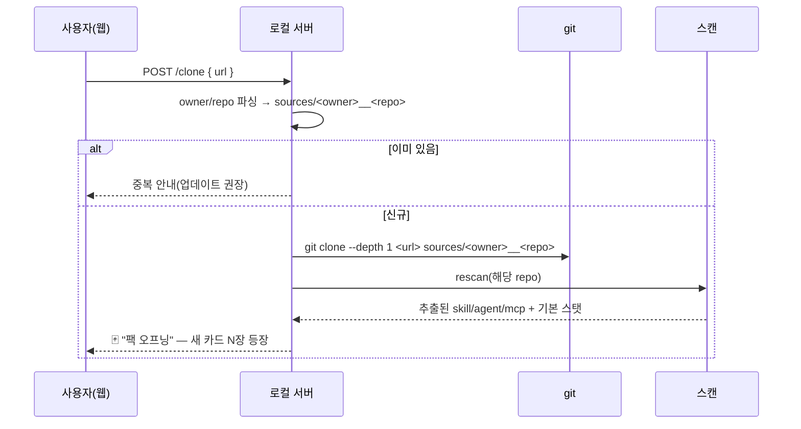
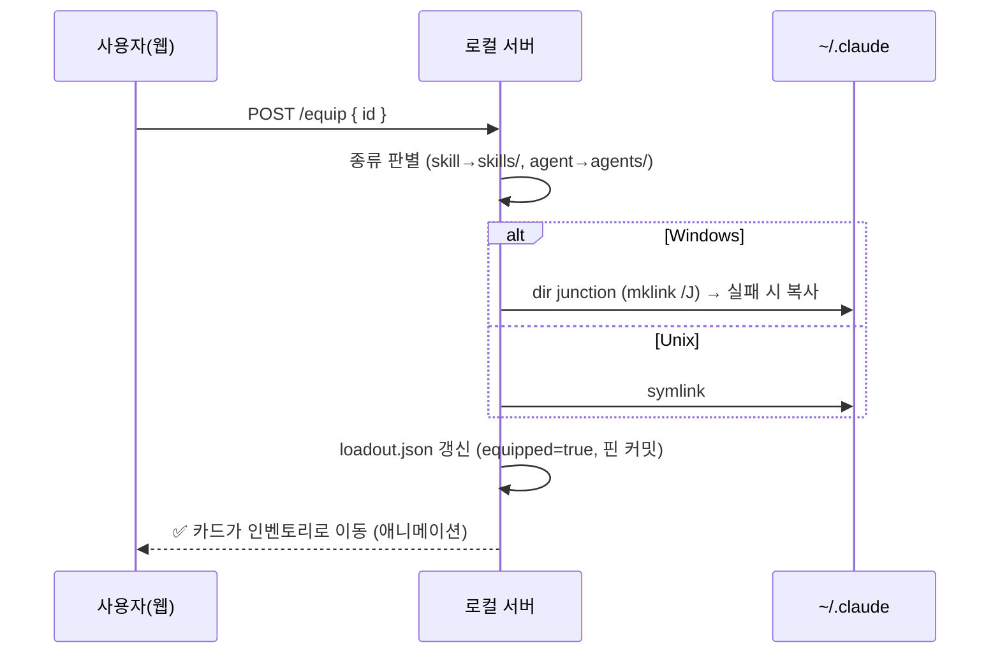
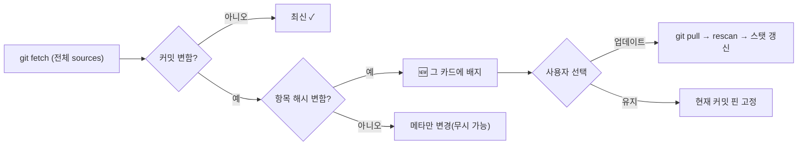

# 04 · 핵심 워크플로

전체 흐름은 하나로 연결된다:

```
link 추가 → clone → 스캔/추출 → 카탈로그(카드) → (비교/검증) → 장착 → 사용 → 업데이트
```

---

## ① Link 추가 → clone → 카드화

> "원하는 GitHub repo는 링크만 넣으면 바로 받아서 리스트업"



- **충돌 방지**: 항상 `sources/<owner>__<repo>`로 clone → repo 이름이 겹쳐도 안전.
- **얕은 clone**(`--depth 1`)로 빠르게. 히스토리는 업데이트 감지에 불필요.
- 대용량(antigravity ≈1,377 skill)도 한 번 받으면 인덱스만 다시 읽음.

---

## ② 스캔 / 추출 / 스탯

`node src/scan.mjs` (서버가 자동 호출하거나 수동 실행)

1. `sources/` 순회 → 탐지 규칙([02](02-data-model.md#탐지-규칙))으로 skill/agent/mcp 식별.
2. frontmatter·구조에서 메타 추출.
3. **기본 스탯** 계산(인기/신선도/파워/명확도/무게) — 객관 지표, 무료.
4. 이름/설명 유사도로 **중복 그룹** 묶기.
5. 이미지 매핑(있으면), 잠정 등급 부여.
6. `data/index.json` 갱신. (멱등)

---

## ③ 비교 / AI 검증 (`+99`)

> "어떤 게 좋은지 비교, 검증하는 AI에게 요청"

- 평소엔 **기본 스탯**만으로 충분히 훑어봄(무료).
- 더 깊게 보고 싶을 때만 **`POST /verify`** → AI judge가:
  - 단일 항목: 유용성/품질을 0–99로 채점 → `+99` 스탯 + 등급 갱신.
  - 그룹 비교: 후보들을 나란히 분석 → **"우세한 쪽 + 근거 + 병합/선택 권장"** 판정.
- **AI judge 어댑터**: 기본 `claude -p`(헤드리스), 교체 가능(`codex`, `gemini`). 결과는 `verdicts.json` 캐시.
- **중복 처리 정책**: 시스템은 **제안까지만**. "둘 다 보관 / 우세한 것만 장착"은 사람이 결정(자동 삭제 없음).

---

## ④ 장착(Equip) → 사용 가능

> "적용하면 사용 가능하게" = `~/.claude`에 연결



- skill → `~/.claude/skills/<name>`, agent → `~/.claude/agents/<name>` 로 연결.
- **즉시 사용**: 다음 세션/리로드에서 Claude Code가 인식.
- **해제**(`/unequip`): 링크 제거 + loadout.json 갱신.
- 이름 충돌 시 소스 접두어(`<owner>-<name>`)로 안전하게.

---

## ⑤ 업데이트 추적

> "git clone 주기적으로 → 새 버전 표시 → 업데이트할지 그대로 둘지 웹에서 관리"



- 주기 실행: `node src/update.mjs`(수동) 또는 OS 스케줄러/`/loop`로 정기.
- `git fetch`(읽기)로 **변경만 감지** → 함부로 pull 안 함.
- repo 단위 🆕 + 항목 단위 🆕 둘 다 표시 → 무엇이 바뀌었는지 정확히.
- 웹에서 카드별/Repo별 **업데이트 / 유지** 선택.

---

## ⑥ 이미지 / 다이어그램

- 기존 14개(`skill-ecosystems/`)를 ecosystem·카테고리에 매핑해 카드/상세에 표시.
- 카드에 **🎨 이미지생성** → `codex-image` 스킬로 해당 skill 다이어그램/아트 생성 → `media/generated/`에 저장 → 카드에 반영.
- 어려운 용어는 호버 툴팁 + 아이콘으로 "보기 쉽게".

관련: [01-architecture.md](01-architecture.md) · [05-roadmap.md](05-roadmap.md)
