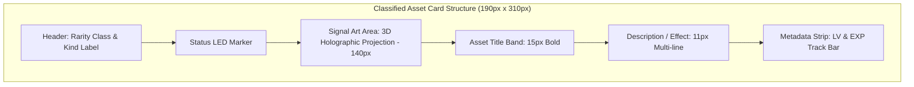

# Orbital Operations Card Design (SHIP / MONITOR Standard)

> [!IMPORTANT]
> 현재 카드 디자인 최우선 기준은 첨부 레퍼런스의 **gstack ▷ SHIP · MONITOR** 카드/패널 스타일이다. 레퍼런스의 전체 레이아웃을 복제하지 않는다. 카드는 더 이상 어두운 기밀 자산 dossier가 아니라, NASA mission-control 문서 안의 **발사 체크리스트 / 궤도 원격측정 행**처럼 보여야 한다.

## 0. Current Direction

카드는 흰 종이/계기판 위에 놓인 작전 항목이다. 사용자가 느껴야 하는 감각은 “스킬 카드 수집”보다 “발사 전 점검 항목을 고르고, 배포 후 감시 모듈을 연결한다”에 가깝다.

- **SHIP lane**: 파란색. 테스트, 리뷰, 배포, 리포트, 설정처럼 발사대에서 궤도로 올리는 흐름.
- **MONITOR lane**: 초록색. 카나리, 성능, 모델 비교, 문서 동기화처럼 배포 이후 궤도에서 감시하는 흐름.
- **Surface**: `#FFFFFF` 또는 매우 옅은 blue/mint tint. 전체 앱 배경까지 과하게 우주 포스터처럼 만들지 않는다.
- **Border**: 얇은 `#A9BDD5`, 선택 시 `#2E73DF` 또는 `#22965A`.
- **Typography**: UI 본문은 Pretendard, 코드/자산명 배지는 고정폭 계열 느낌.
- **Background**: 카드 내부에 밝은 blueprint grid를 사용한다. 앱 전체에는 더 약하게만 사용한다.

## Card Anatomy

1. **Lane Header**
   - `SHIP`, `MONITOR`, `ASSET`, `MODULE` 중 하나.
   - 파란/초록 solid 또는 subtle gradient header를 사용한다.
2. **Operation Icon Cell**
   - 로켓, 체크리스트, 구름 업로드, 차트, 기어, 위성/레이더 같은 친숙한 기호.
   - 실제 로고/국기/군 문장은 사용하지 않는다.
3. **Code Name Badge**
   - `ship`, `land-and-deploy`, `canary`처럼 고정폭 느낌의 배지.
   - 배지는 흐린 blue/mint 배경과 1px 테두리.
4. **Plain Korean Description**
   - 한 줄 또는 두 줄로 기능을 설명한다.
   - 장식보다 읽기가 우선이다.
5. **Telemetry Strip**
   - LV/신뢰도/상태/소스 같은 메타를 얇은 행으로 표시한다.

## State Rules

- Hover: 행/카드가 1~2px 상승하고 경계선이 더 선명해진다.
- Selected: 좌측에 굵은 blue/green rail이 켜지고, 약한 blueprint shadow를 준다.
- Equipped: 작은 체크/READY 라벨을 사용한다. 카드 전체를 진하게 채우지 않는다.
- Duplicate: `복수`, `동일 계열` 같은 작은 칩으로 표시하되 주요 이름을 밀어내지 않는다.

## Legacy Tactical Dossier Notes

아래 내용은 이전 Black-Ops 디자인 기준이다. 새 SHIP/MONITOR 기준과 충돌하면 이 문서의 상단 기준이 우선한다.

> [!IMPORTANT]
> 이 문서는 Loadout의 카드 UI를 설계하거나 수정할 때 항상 최우선으로 준수해야 하는 디자인 표준 가이드라인이다.  
> 상위 디자인 원칙은 `design.md`의 **Black-Ops Anomaly Tactical Console** 지침을 따르며, 핵심 시각 기준은 최첨단 군사용 시뮬레이션 콘솔의 미학과 고도로 세련된 3D 홀로그램 분석 아트를 지향한다.

---

## 1. Core Direction

Loadout의 카드는 단순한 판타지 RPG 카드나 캐주얼 게임의 카드가 아니다. 카드는 **기밀 작전 자산(Classified Asset)**, **프로토콜**, **지원 모듈**, **요원 프로필**을 통합 관리하는 최첨단 작전 제어 콘솔의 dossier 파일이다.

사용자가 카드와 상호작용할 때 느껴야 하는 핵심 감각은 다음과 같다:
* **"작전 통제권 확보"**: 기밀 자산의 보안 락이 해제되며 작전에 투입되는 감각.
* **"고해상도 홀로그램 분석"**: 밋밋한 2D 다이어그램이 아닌, 입체적이고 역동적으로 빛나는 3D 신호 이상 징후 분석 화면을 관찰하는 느낌.
* **"진중하고 위압적인 미학"**: 가벼운 장난감이 아닌 기밀 작전에 걸맞은 그래파이트 질감과 절제된 광원.

---

## 2. Card Layout & Anatomy

카드는 가로 너비 **최소 190px** (그리드 `minmax(190px, 1fr)`), 세로 높이 **최소 310px**의 단단한 플레이트 형태로 구성된다.



### 상세 레이아웃 스펙
1. **Class / Cost Chip** (좌상단)
   - `S-CLASS`, `A-CLASS`, `B-CLASS` 등급 라벨 또는 배치 자원 코스트.
   - 각진 메탈릭 칩 형태로, 등급별 대표 액센트 컬러 하이라인을 가짐.
2. **Status LED Marker** (우상단)
   - 군사용 통신 장비의 상태 표시등처럼 직관적으로 반응하는 LED 도트.
   - 장착/투입 대기 상태일 때 활성 컬러로 정밀 발광(Glow)하며, 미투입 상태일 때 뮤트 그래파이트 컬러 유지.
3. **Signal Art Area (신호 분석창)** (상단 140px 고정)
   - **핵심 특징**: 밋밋한 2D 플로차트 스타일을 배제하고, 어둡고 깊은 그래파이트 격자 배경 위에 뜨는 **입체적인 3D 홀로그램 프로젝션(Volumetric Hologram)**을 배치한다.
   - **프레임 배제**: 이미지 외곽에 테두리나 종이 카드 형태의 레이아웃이 중첩되어 나타나지 않도록, 캔버스를 100% 꽉 채우는 완전한 에지투에지(Edge-to-Edge) 구도로 생성한다.
4. **Asset Title Band** (중단)
   - 자산명은 가독성이 뛰어난 Pretendard 폰트로 굵고 단단하게 표시 (폰트 크기 `15px`).
   - 2줄 초과 시 생략 부호(`...`) 처리.
5. **Description / Effect** (하단)
   - 자산의 세부 효과 또는 분석 보고서 요약 (폰트 크기 `11px`).
   - 가독성이 좋은 1.35배의 줄 간격을 채택하며, 2줄 이내로 제어.
6. **Metadata Strip & EXP Track** (최하단)
   - 자산의 등급별 색상으로 채워진 **EXP 게이지 바**와 **LV 라벨** 배치.

---

## 3. Visual & Aesthetic Guidelines (입체감과 디테일)

카드가 "너무 평평하고 밋밋해지는(Flat & Plain)" 부작용을 방지하기 위해 다음과 같은 시각적 입체 장치를 의무적으로 적용한다.

### 3D Volumetric Art Direction (카드 이미지 생성 기준)
이미지 생성 시 플랫한 2D 아이콘이나 플로차트 키워드를 피하고, **3D 입체 투영 및 라이팅**을 극대화한다.

* **Volumetric Hologram**: 공중에 떠 있는 듯한 입체 광원(Glowing volume) 효과.
* **3D Isometric Wireframes**: 비스듬한 각도에서 바라본 입체 격자 및 구조물 형상.
* **Glowing Particle Streams**: 신호선을 따라 미세하게 흐르는 네온 입자 시뮬레이션.
* **Dark Depth Backdrop**: 깊이감이 느껴지는 어두운 백그라운드와 그 위에 부유하는 고대비 신호 그래픽.

### Rarity / Class Color Tokens

| Class | UI Label | Accent Color | Visual Representation |
|---|---|---|---|
| **Legendary** | `S-CLASS` | 기밀 앰버 (`#D49A2A`) | 앰버/골드 발광 프로젝션, 강렬하고 조밀한 데이터 구조 |
| **Epic** | `A-CLASS` | 이상 바이올렛 (`#8D5CFF`) | 신비로운 보랏빛 입자 안개 및 중력 이상 파형 |
| **Rare** | `B-CLASS` | 레이더 시안 (`#38D6C6`) | 정밀 레이더 스캔라인, 고속 전송 주파수 흔적 |
| **Uncommon** | `C-CLASS` | 시그널 그린 (`#39D98A`) | 안정적 데이터 플로우 및 연결 성공 지표선 |
| **Common** | `D-CLASS` | 그래파이트 (`#8B938B`) | 기본 시스템 매트릭스 그리드 |

---

## 4. UI Layout Constraints (공간 극대화)

메인 헤더 배너(`.hero-banner`)와 전술 배치 보드(`.formation-panel`) 등 상단 영역은 **최소 160px** 높이로 컴팩트하게 축소하여, 스크롤 없이도 하단 카드 그리드(`.grid`)가 최대한 넓고 쾌적하게 한눈에 들어올 수 있도록 구조적 균형을 유지한다.

---

## 5. Reference Prompts

카드 아트를 이미지 생성기로 새로 빌드할 때 사용하는 마스터 템플릿이다.

### S-Class (pptx-official 등) 3D 입체형 프롬프트 예시
```text
3D volumetric holographic projection graphic for black-ops tactical console screen,
matte black micro-grid backdrop. Glowing neon amber/gold (#D49A2A) volumetric particle streams,
3D isometric wireframe presentation slides stacked and decompressing into floating XML schema nodes,
glowing anomaly radar scan wave. Rich sci-fi aesthetic, vibrant volumetric lighting,
sharp glowing details. Borderless, edge-to-edge full canvas graphic.
No outer card frame, no borders, no hands, no background tables, no text.
```

### A-Class (frontend-design 등) 3D 입체형 프롬프트 예시
```text
3D volumetric holographic projection graphic for black-ops tactical console screen,
matte black micro-grid backdrop. Glowing neon cyan/turquoise (#38D6C6) volumetric particle streams,
3D isometric wireframe web layout canvases intersecting and rendering UI elements in space,
glowing anomaly radar scan wave. Rich sci-fi aesthetic, vibrant volumetric lighting,
sharp glowing details. Borderless, edge-to-edge full canvas graphic.
No outer card frame, no borders, no hands, no background tables, no text.
```
